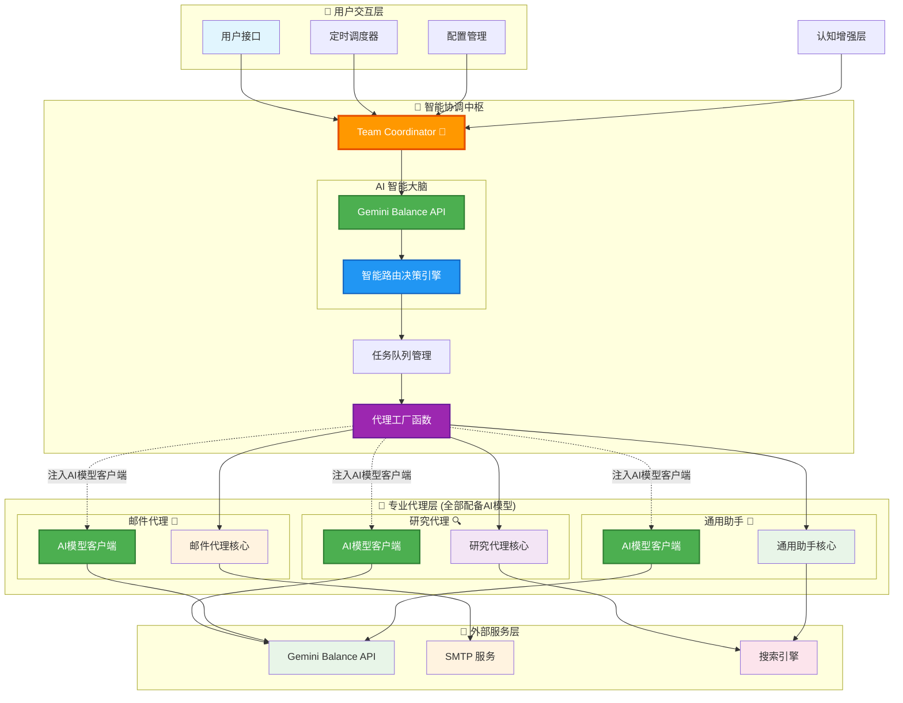

# AutoGen v0.4+ Multi-Agent AI System

<div align="center">


**🤖 智能多代理 AI 系统，集成定时邮件服务与智能研究功能**

[功能特性](#-功能特性) •
[快速开始](#-快速开始) •
[安装指南](#-安装指南) •
[使用文档](#-使用文档) •
[配置说明](#-配置说明)

</div>

---

## 📋 目录

- [项目概述](#-项目概述)
- [功能特性](#-功能特性)
- [系统架构](#-系统架构)
- [快速开始](#-快速开始)
- [安装指南](#-安装指南)
- [配置说明](#-配置说明)
- [使用文档](#-使用文档)
- [API 参考](#-api-参考)
- [故障排除](#-故障排除)
- [贡献指南](#-贡献指南)
- [许可证](#-许可证)

---

## 🎯 项目概述

AutoGen v0.4+ Multi-Agent AI System 是一个基于 Microsoft AutoGen 框架的智能自动化平台，专为企业级 AI 应用设计。系统集成了多代理协作、智能研究、定时邮件服务等功能，支持 Gemini Balance API，提供完整的 AI 工作流解决方案。

### 🌟 核心亮点

- 🤖 **多代理协作**: 基于 AutoGen v0.4+ 的智能代理系统
- 📧 **定时邮件服务**: 自动生成和发送 AI 研究报告
- 🧠 **认知增强**: 集成 Context-Engineering 认知工具
- 🔄 **实时 SMTP**: 真实邮件发送，支持 Gmail 等主流服务
- 🎯 **灵活调度**: 支持每日/每周/每月定时任务
- 🛠️ **易于部署**: 完整的环境配置和部署脚本

---

## ✨ 功能特性

### 🤖 智能代理系统
- **研究代理**: 智能信息搜索、分析和总结
- **邮件代理**: 自动邮件生成和 SMTP 发送
- **团队协调器**: 多代理任务分配和协作管理

### 📧 定时邮件服务
- **智能内容生成**: 基于 Gemini 模型的研究报告
- **灵活调度配置**: 支持多主题、多收件人、多频率
- **真实邮件发送**: 集成 SMTP 服务，确保邮件投递
- **交互式管理**: 完整的 CLI 界面管理调度任务

### 🧠 认知增强功能
- **认知分析**: IBM 认知工具集成
- **协议 Shell**: 结构化代理通信协议
- **元认知监控**: 系统自我监控和优化

### 🔧 开发工具
- **多运行模式**: 交互式、批量、演示、测试模式
- **配置管理**: 环境变量和 JSON 配置文件
- **诊断工具**: SMTP 测试和系统验证工具

---

## 🏗️ 系统架构



### 核心组件

| 组件 | 文件 | 功能描述 |
|------|------|----------|
| **🧠 智能协调器** | `team_coordinator_v4.py` | **AI智能大脑，负责任务路由决策和代理调度** |
| **🏭 代理工厂** | `base_agent_v4.py` | **创建代理并注入AI模型客户端，确保所有代理具备AI智能** |
| 主系统 | `main_v4.py` | 用户交互和会话管理 |
| 启动器 | `run_v4.py` | 多模式启动脚本 |
| **🔍 研究代理** | `research_agent_v4.py` | **基于AI模型的智能搜索、深度分析和研究报告生成** |
| **📧 邮件代理** | `email_agent_v4.py` | **基于AI模型的智能邮件生成和SMTP发送，通过工厂函数获得AI能力** |
| **🤖 通用助手** | `base_agent_v4.py` | **基于AI模型的日常对话和实时信息查询，具备深度认知能力** |
| 邮件服务 | `scheduled_email_service.py` | 定时邮件生成和发送 |
| 研究服务 | `scheduled_research.py` | 定时研究任务执行 |
| SMTP 工具 | `test_direct_smtp.py` | 邮件发送测试和诊断 |

### 🚀 架构亮点

- **🧠 智能协调中枢**: Team Coordinator 配备 AI 大脑，使用 Gemini Balance API 进行智能路由决策
- **🎯 智能任务分配**: 基于用户请求的复杂度、专业性和紧急程度进行智能分配
- **🏭 统一AI模型注入**: 所有专业代理通过工厂函数统一获得AI模型客户端，确保智能一致性
- **📧 邮件代理AI智能**: 邮件代理继承自 `EnhancedAssistantAgent`，通过 `model_client` 参数直接获得AI能力
- **🔗 OpenAI兼容架构**: 所有AI调用统一使用OpenAI兼容格式，连接Gemini Balance API
- **🧠 深度认知能力**: 每个代理都配备 `CognitiveLevel.DEEP` 认知水平，具备专业分析能力
- **🔄 统一调度管理**: 所有代理由智能协调器统一调度，避免冲突和重复
- **⚡ 自适应路由**: AI 大脑能够学习和适应不同类型的任务需求
- **🛡️ 备用机制**: 当 AI 路由失败时，自动切换到关键词匹配备用路由

### 📧 邮件代理AI智能架构详解

邮件代理的智能来源于多层次的AI模型集成架构：

#### 🔧 **AI模型注入机制**
```python
# 1. 通过工厂函数创建邮件代理
async def create_enhanced_agent(
    name: str,
    agent_type: str = "email",
    api_key: str,
    base_url: str,
    model: str = "gemini-2.5-flash"
):
    # 创建AI模型客户端
    model_client = OpenAIChatCompletionClient(
        model=model,
        api_key=api_key,
        base_url=base_url,  # 连接到 Gemini Balance API
        model_info=ModelInfo(family="gemini", ...)
    )
    
    # 注入AI模型到邮件代理
    return EnhancedEmailAgent(
        name=name,
        model_client=model_client,  # ← AI智能在此注入
        cognitive_level=CognitiveLevel.DEEP
    )
```

#### 🧠 **继承AI能力**
```python
class EnhancedEmailAgent(EnhancedAssistantAgent):
    def __init__(self, model_client: OpenAIChatCompletionClient, ...):
        super().__init__(
            model_client=model_client,  # ← 继承完整AI能力
            cognitive_level=CognitiveLevel.DEEP,
            system_message=self._build_email_system_message()
        )
```

#### 🎯 **AI智能工作流程**
1. **智能路由**: Team Coordinator AI大脑识别邮件任务
2. **代理创建**: 工厂函数创建邮件代理并注入AI模型客户端
3. **AI生成**: 邮件代理使用Gemini模型生成专业邮件内容
4. **技术集成**: 通过SMTP/Gmail API实际发送邮件
5. **质量保证**: AI自动检查邮件专业性和准确性

#### 🔗 **API调用链路**
```
用户请求 → Team Coordinator → AI路由决策 → 邮件代理创建 → 
AI模型客户端 → Gemini Balance API → 智能邮件生成 → SMTP发送
```

**关键特性**:
- ✅ **完全基于AI模型**: 邮件代理通过 `model_client` 参数获得完整AI能力
- ✅ **深度认知分析**: 使用 `CognitiveLevel.DEEP` 进行专业内容分析
- ✅ **OpenAI兼容格式**: 统一使用 `/v1/chat/completions` 端点调用Gemini API
- ✅ **专业系统提示**: 通过 `_build_email_system_message()` 构建邮件专业提示
- ✅ **智能个性化**: 根据收件人、场景、语调自动调整邮件风格

---

## 🚀 快速开始

### 前置要求
- Python 3.8+ (推荐 3.10+)
- Git
- Gmail 账户或其他 SMTP 服务
- Gemini Balance API 访问权限

### 一键启动
```bash
# 1. 克隆仓库
git clone <repository-url>
cd autogen-multi-agent

# 2. 安装依赖
pip install -r requirements.txt

# 3. 配置环境
cp .env.example .env.local
# 编辑 .env.local 添加您的 API 密钥

# 4. 测试系统
python run_v4.py --test

# 5. 启动定时邮件服务
python scheduled_email_service.py
```

### 验证安装
```bash
# 测试 SMTP 配置
python test_direct_smtp.py

# 启动交互模式
python run_v4.py --interactive
```

---

## 🛠️ 安装指南

### 1. 环境准备

#### Python 环境
```bash
# 检查 Python 版本
python --version  # 需要 3.8+

# 创建虚拟环境
python -m venv venv

# 激活虚拟环境
# Windows
venv\Scripts\activate
# macOS/Linux
source venv/bin/activate
```

#### 依赖安装
```bash
# 安装核心依赖
pip install -r requirements.txt

# 验证 AutoGen 安装
python -c "import autogen_agentchat; print('✅ AutoGen v0.4+ 安装成功')"
```

### 2. API 服务配置

#### Gemini Balance API
1. 获取 Gemini Balance API 密钥
2. 确认 API 端点 URL
3. 测试 API 连接

#### Gmail SMTP 配置
1. **启用两步验证**
   - 访问 [Google 账户设置](https://myaccount.google.com/)
   - 安全 → 两步验证

2. **生成应用密码**
   - 安全 → 两步验证 → 应用密码
   - 选择"邮件"和设备类型
   - 复制生成的 16 位密码

3. **测试 SMTP 连接**
   ```bash
   python test_direct_smtp.py
   ```

---

## ⚙️ 配置说明

### 环境变量配置

创建 `.env.local` 文件：
```env
# Gemini Balance API 配置
OPENAI_API_KEY=your_gemini_balance_api_key_here
OPENAI_BASE_URL=http://your-gemini-balance-url/v1
OPENAI_MODEL=gemini-2.5-flash

# SMTP 邮件配置
SENDER_EMAIL=your-email@gmail.com
SENDER_PASSWORD=your_16_digit_app_password
SENDER_NAME=AI研究系统
SMTP_SERVER=smtp.gmail.com
SMTP_PORT=587

# 可选配置
LOG_LEVEL=INFO
MAX_RETRIES=3
TIMEOUT_SECONDS=30
```

### 邮件调度配置

编辑 `email_schedules.json`：
```json
{
  "schedules": [
    {
      "topic": "AGI人工智能",
      "recipient": "recipient@example.com",
      "schedule_time": "09:00",
      "frequency": "daily",
      "subject_template": "每日AGI研究动态 - {date}",
      "enabled": true
    },
    {
      "topic": "科技新闻",
      "recipient": "tech-team@company.com",
      "schedule_time": "18:00",
      "frequency": "weekly",
      "subject_template": "每周科技资讯汇总 - {date}",
      "enabled": false
    }
  ]
}
```

#### 配置参数说明

| 参数 | 类型 | 说明 | 示例 |
|------|------|------|------|
| `topic` | string | 研究主题关键词 | "AGI人工智能" |
| `recipient` | string | 收件人邮箱 | "user@example.com" |
| `schedule_time` | string | 发送时间 (24小时制) | "09:00" |
| `frequency` | string | 发送频率 | "daily", "weekly", "monthly" |
| `subject_template` | string | 邮件主题模板 | "研究报告 - {date}" |
| `enabled` | boolean | 是否启用此调度 | true, false |

---

## 📖 使用文档

### 主系统使用

#### 交互式模式
```bash
# 启动交互式对话
python main_v4.py

# 或使用启动脚本
python run_v4.py --interactive
```

**功能特性:**
- 实时 AI 对话
- 多代理协作
- 任务执行和监控
- 认知分析工具

#### 批量任务模式
```bash
# 执行批量任务
python run_v4.py --batch tasks.json
```

**任务配置示例:**
```json
{
  "tasks": [
    {
      "type": "research",
      "topic": "量子计算最新进展",
      "output": "research_report.md"
    },
    {
      "type": "email",
      "subject": "研究报告",
      "recipient": "team@company.com",
      "content_file": "research_report.md"
    }
  ]
}
```

### 定时邮件服务

#### 启动服务
```bash
python scheduled_email_service.py
```

#### 管理界面
```
🤖 AutoGen v0.4+ 简化定时邮件服务
==================================================

📋 可用操作:
1. 查看邮件调度    # 显示当前所有调度配置
2. 添加邮件调度    # 交互式添加新调度
3. 启用/禁用调度   # 切换调度状态
4. 启动定时服务    # 开始自动定时发送
5. 测试发送邮件    # 立即测试邮件发送
0. 退出

请选择操作 (0-5):
```

#### 操作说明

**1. 查看邮件调度**
- 显示所有配置的邮件调度
- 包含状态、时间、收件人信息

**2. 添加邮件调度**
- 交互式配置新的邮件调度
- 支持自定义主题、时间、频率

**3. 启用/禁用调度**
- 快速切换调度任务状态
- 无需重启服务

**4. 启动定时服务**
- 开始自动定时发送
- 后台运行，支持 Ctrl+C 优雅退出

**5. 测试发送邮件**
- 立即发送测试邮件
- 验证配置和连接

### 运行模式详解

#### 演示模式
```bash
python run_v4.py --demo
```
- 展示系统核心功能
- 包含预设演示任务
- 适合产品演示

#### 测试模式
```bash
python run_v4.py --test
```
- 验证系统配置
- 检查 API 连接
- 测试代理功能

#### 帮助信息
```bash
python run_v4.py --help
```

### 诊断工具

#### SMTP 测试
```bash
python test_direct_smtp.py
```
- 测试邮件服务器连接
- 验证认证信息
- 发送测试邮件

---

## 🔌 API 参考

### 核心类

#### AutoGenMultiAgentSystem
```python
from main_v4 import AutoGenMultiAgentSystem

# 初始化系统
system = AutoGenMultiAgentSystem()
await system.initialize()

# 执行任务
result = await system.execute_task("研究最新的AI技术发展")
```

#### SimpleScheduledEmailService
```python
from scheduled_email_service import SimpleScheduledEmailService

# 初始化邮件服务
service = SimpleScheduledEmailService("email_schedules.json")
await service.initialize()

# 发送测试邮件
await service.send_test_email("AGI人工智能")
```

### 环境变量

| 变量名 | 必需 | 默认值 | 说明 |
|--------|------|--------|------|
| `OPENAI_API_KEY` | ✅ | - | Gemini Balance API 密钥 |
| `OPENAI_BASE_URL` | ✅ | - | API 端点 URL |
| `OPENAI_MODEL` | ✅ | - | 模型名称 |
| `SENDER_EMAIL` | ✅ | - | 发件人邮箱 |
| `SENDER_PASSWORD` | ✅ | - | 邮箱密码/应用密码 |
| `SENDER_NAME` | ❌ | "AI研究系统" | 发件人显示名称 |
| `SMTP_SERVER` | ❌ | "smtp.gmail.com" | SMTP 服务器 |
| `SMTP_PORT` | ❌ | "587" | SMTP 端口 |

---

## 🔧 故障排除

### 常见问题

#### 1. API 连接失败
**错误**: `401 Unauthorized` 或连接超时

**解决方案**:
```bash
# 检查 API 密钥
echo $OPENAI_API_KEY

# 测试 API 连接
curl -H "x-goog-api-key: $OPENAI_API_KEY" $OPENAI_BASE_URL/models

# 验证环境变量
python -c "import os; print(os.getenv('OPENAI_API_KEY')[:10] + '...')"
```

#### 2. 邮件发送失败
**错误**: `SMTP Authentication Error`

**解决方案**:
```bash
# 测试 SMTP 配置
python test_direct_smtp.py

# 检查应用密码
# 确保使用 16 位应用密码，不是账户密码

# 验证 Gmail 设置
# 1. 启用两步验证
# 2. 生成应用密码
# 3. 使用应用密码而非账户密码
```

#### 3. 模块导入错误
**错误**: `ModuleNotFoundError`

**解决方案**:
```bash
# 重新安装依赖
pip install -r requirements.txt

# 检查 Python 路径
python -c "import sys; print(sys.path)"

# 验证虚拟环境
which python
```

#### 4. 定时服务无响应
**错误**: 服务启动后无法交互

**解决方案**:
```bash
# 使用交互式终端
python -i scheduled_email_service.py

# 或在 IDE 中运行
# 确保终端支持交互输入
```

### 日志调试

#### 启用详细日志
```python
import logging
logging.basicConfig(level=logging.DEBUG)
```

#### 查看系统日志
```bash
# 查看最近的错误
tail -f *.log

# 搜索特定错误
grep -i "error" *.log
```

### 性能优化

#### 内存使用
- 监控代理内存使用
- 定期清理对话历史
- 调整批处理大小

#### API 调用优化
- 实现请求缓存
- 设置合理的超时时间
- 使用连接池

---

## 🤝 贡献指南

### 开发环境设置

```bash
# 1. Fork 仓库并克隆
git clone https://github.com/your-username/autogen-multi-agent.git
cd autogen-multi-agent

# 2. 创建开发分支
git checkout -b feature/your-feature-name

# 3. 安装开发依赖
pip install -r requirements.txt
pip install -r requirements-dev.txt  # 如果存在

# 4. 运行测试
python run_v4.py --test
```

### 代码规范

#### Python 代码风格
- 遵循 PEP 8 标准
- 使用 Black 格式化代码
- 添加类型注解
- 编写文档字符串

#### 提交规范
```bash
# 提交格式
git commit -m "feat: 添加新的邮件调度功能"
git commit -m "fix: 修复 SMTP 连接问题"
git commit -m "docs: 更新 README 文档"
```

#### 拉取请求
1. 确保代码通过所有测试
2. 更新相关文档
3. 添加变更说明
4. 请求代码审查

### 报告问题

使用 [GitHub Issues](https://github.com/your-repo/issues) 报告问题:

1. **Bug 报告**: 包含复现步骤、错误信息、环境信息
2. **功能请求**: 描述需求、使用场景、预期行为
3. **文档改进**: 指出不清楚或错误的文档内容

---

## 📄 许可证

本项目采用 MIT 许可证 - 查看 [LICENSE](LICENSE) 文件了解详情。

---

## 🙏 致谢

- [Microsoft AutoGen](https://github.com/microsoft/autogen) - 多代理框架
- [Google Gemini](https://ai.google.dev/) - AI 模型支持
- [Context-Engineering](https://github.com/context-engineering) - 认知工具集成

---

## 📞 支持

- 📧 邮箱: support@your-domain.com
- 💬 讨论: [GitHub Discussions](https://github.com/your-repo/discussions)
- 🐛 问题: [GitHub Issues](https://github.com/your-repo/issues)
- 📖 文档: [项目文档](https://your-docs-site.com)

---

<div align="center">

**⭐ 如果这个项目对您有帮助，请给我们一个星标！**

Made with ❤️ by the AutoGen Multi-Agent Team

</div>
